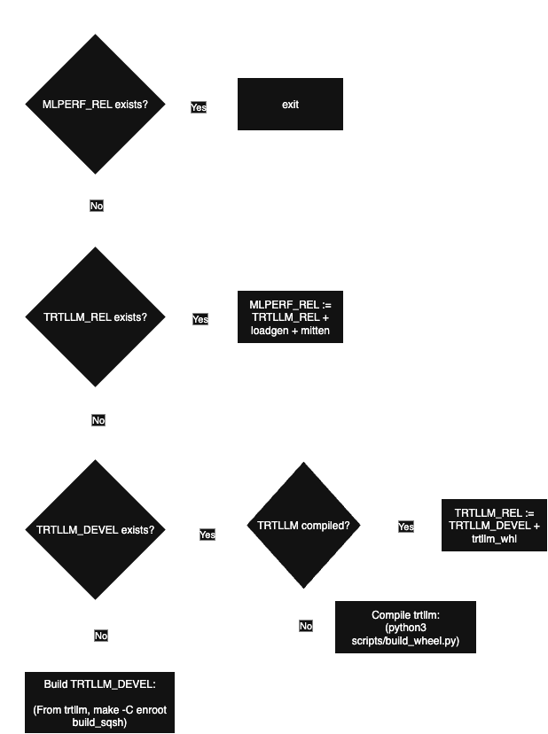

# Multi-step builds using enroot

This is a build flow for the scale-out platform.  
**Tested on LLM workloads only** - but will be soon extended for non-LLM workloads as well.

## TLDR: Build
To build the required images:
```bash
cd closed/NVIDIA
git submodule update --init --recursive # Fetch trtllm, mlc-inference, mitten
# make changes to trtllm as necessary, if reqd

salloc --nodes=1 -p backfill # allocate a non-priority node for building

./enroot/run.sh --stage build \
    --image-dir /dir/to/store/sqsh_images \ # optional, defaults to enroot/images/
    --trtllm-build-arch "all" # optional, defaults to "100-real;103-real"
```
Default for exporting sqsh images is `./enroot/images/`.  
If you want sqsh files to be stored in a separate storage (for example, `/raid` or `/lustre`):
- Pass `--image-dir /raid/image/dir` in each invocation of `enroot/run.sh`
- Or, instead of passing a `--image-dir` - it is helpful to symlink the default location: `ln -sf /lustre/image/dir enroot/images`

## TLDR: Run
To run the `mlperf_rel` sqsh image in a pseudo-terminal:
```bash
cd closed/NVIDIA
salloc --nodes=1 -p compute-perf
./enroot/run.sh --stage run \
    --mount /path/to/mlperf_inference_storage:/home/mlperf_inference_storage
```

## Stages
There are 2 stages:
- `--stage build`: Builds the required images. There are 3 sub-stages, and these are:
  - `trtllm_devel` image: An image which can be used to compile TRTLLM binaries
  - `trtllm_rel` image: An image with TensorRT-LLM installed in it. 
    - `trtllm_devel` + TensorRT-LLM
    - By fetching a trtllm image from NGC, we can skip to the 3rd build step and save time.
  - `mlperf_rel` image: An image with MLPerf Inference installed in it.
    - For LLMs, this is `trtllm_rel` + `mitten` + `mlc_loadgen`.

- `--stage run`: Launches a slurm job step with a enroot sqsh image. Uses `$image_dir/mlperf_rel.sqsh` to start a srun job step.

A flow chart illustrating the above flow: 



As you can see, supplying a sqsh file is sufficient to skip a build step. 

## Reusing pre-built artifacts
To skip any stage, you must point the output sqsh of that stage to a valid sqsh file.
For example, to re-use a [TRTLLM release container](https://catalog.ngc.nvidia.com/orgs/nvidia/teams/tensorrt-llm/containers/release?version=1.1.0rc5):
```bash
enroot import -o $image_dir/trtllm_rel.sqsh docker://nvcr.io/nvidia/tensorrt-llm/release:1.0.0
./enroot/run.sh --stage build
# Skips the trtllm_rel stage - will compile_inference (build_loadgen), then create a mlperf_rel sqsh
```
The build flow will detect this sqsh file exists, and skip the `trtllm_devel`, `trtllm_compile` and `trtllm_rel` stages and go straight to building `mlperf_rel` image with above as input. 

Similarly, if you want to rebuild TRTLLM but not waste time in `trtllm_devel` stage, you must have a valid sqsh under `$image_dir/trtllm_devel.sqsh`


## Gitmodules
All third party software is now defined as git modules under [`3rdparty/`](../3rdparty/). This will have `mitten`, `trtllm` and `mlc-inference`.
- The user must make sure that they use the correct version of `trtllm` before invoking the build stage.
- Different mlperf branches must update the submodule version accordingly. For example, a Vera-Rubin mlperf development branch will update `3rdparty/trtllm` to perhaps a pre-release version.
- Any changes made to the trtllm directory will be reflected in the final built images.
- To defer to defaults of the branch you are in: `rm -rf 3rdparty && git submodule update --init --recursive`
